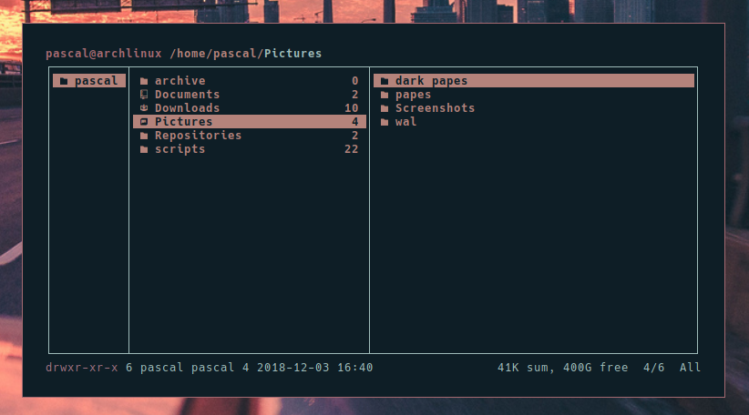
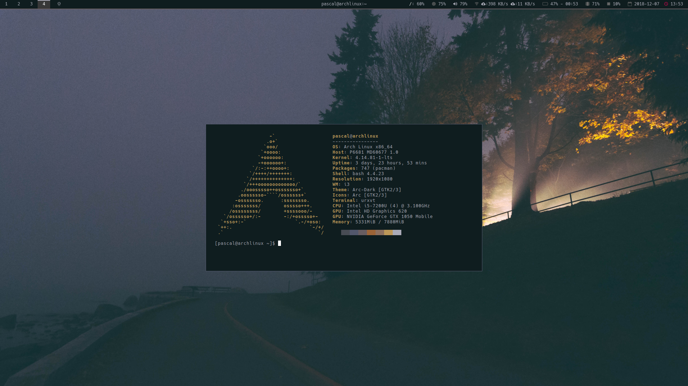
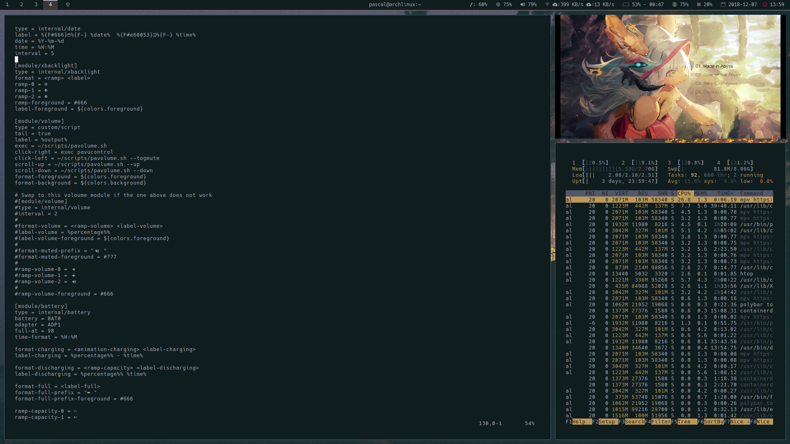

# Arch install and Rice guide
- [Arch install and Rice guide](#arch-install-and-rice-guide)
  - [Arch LTS UEFI Instalation](#arch-lts-uefi-instalation)
    - [Setup to allow ssh from other system](#setup-to-allow-ssh-from-other-system)
    - [Setup mirrorlists](#setup-mirrorlists)
    - [Setup paritions](#setup-paritions)
    - [set partition file system, install arch and chroot into system](#set-partition-file-system-install-arch-and-chroot-into-system)
    - [Enable dhcpcd, Install grub, efi, ssh, linux kernal](#enable-dhcpcd-install-grub-efi-ssh-linux-kernal)
    - [Set keyboard layout](#set-keyboard-layout)
    - [Update keyboard, enable sshd, mount and install grub on boot partiton](#update-keyboard-enable-sshd-mount-and-install-grub-on-boot-partiton)
    - [Create Swapfile](#create-swapfile)
    - [Setting discard for SSD's](#setting-discard-for-ssds)
    - [Enabling SSH for root user](#enabling-ssh-for-root-user)
    - [Enable SSH and reboot](#enable-ssh-and-reboot)
  - [Post Instalation](#post-instalation)
    - [Set Keyboard lanauge](#set-keyboard-lanauge)
    - [enable Multilib for 32 bit pacakges](#enable-multilib-for-32-bit-pacakges)
    - [Install X, Network Manager, I3-Gaps, Fonts, Chromium, MPV, Pulseaudio, And other applications.](#install-x-network-manager-i3-gaps-fonts-chromium-mpv-pulseaudio-and-other-applications)
    - [Enable Network Manager and Lightdm](#enable-network-manager-and-lightdm)
    - [Enable sudo to run all commands](#enable-sudo-to-run-all-commands)
    - [Create user account](#create-user-account)
    - [Disable root SSH](#disable-root-ssh)
    - [Set i3 for when X starts](#set-i3-for-when-x-starts)
    - [Install yaourt](#install-yaourt)
    - [Install Yosemite San Francisco Font](#install-yosemite-san-francisco-font)
    - [Install Fonts, Polybar, Applications and Themes](#install-fonts-polybar-applications-and-themes)
    - [Install Arc Icon Theme and Ranger Devicons](#install-arc-icon-theme-and-ranger-devicons)
    - [Set GTK Font](#set-gtk-font)
    - [Copy fonts.conf to prevent any monospace issues on applications](#copy-fontsconf-to-prevent-any-monospace-issues-on-applications)
- [Previews](#previews)
  - [Ranger](#ranger)
  - [Desktop with Neofetch](#desktop-with-neofetch)
  - [Fake busy](#fake-busy)
  - [Lock Screen](#lock-screen)
  - [Login Screen](#login-screen)

---
## Arch LTS UEFI Instalation
---
### Setup to allow ssh from other system
>set root password
```
passwd
```
>enable DHCP and start SSH
```
dhcpcd
systemctl start sshd
```
### Setup mirrorlists
>SSH onto the system so you can copy paste commands in
```
cat "https://www.archlinux.org/mirrorlist/?country=GB&protocol=http&protocol=https&ip_version=4" > /etc/pacman.d/mirrorlist
sed -i 's/^#Server/Server/' /etc/pacman.d/mirrorlist
pacman -Syyy
```
### Setup paritions
```
fdisk /dev/sda
g
n
1
ENTER
+300M
t
1
n
2
ENTER
ENTER
```
### set partition file system, install arch and chroot into system
```
mkfs.fat -F32 /dev/sda1
mkfs.ext4 /dev/sda2
mount /dev/sda2 /mnt
pacstrap -i /mnt base
genfstab -U -p /mnt >> /mnt/etc/fstab
arch-chroot /mnt
```
### Enable dhcpcd, Install grub, efi, ssh, linux kernal
```
systemctl enable dhcpcd.service
pacman -S grub efibootmgr dosfstools openssh os-prober mtools linux-headers linux-lts linux-lts-headers
```
### Set keyboard layout
>Uncomment en_GB.UTF-8
```
vi /etc/locale.gen
```
### Update keyboard, enable sshd, mount and install grub on boot partiton
> ignore the warning after running the grub-mkconfig
```
locale-gen
systemctl enable sshd
mkdir /boot/EFI
mount /dev/sda1 /boot/EFI
grub-install --target=x86_64-efi --bootloader-id=grub_uefi --recheck
cp /usr/share/locale/en\@quot/LC_MESSAGES/grub.mo /boot/grub/locale/en.mo
grub-mkconfig -o /boot/grub/grub.cfg
```
### Create Swapfile
```
fallocate -l 8G /swapfile
chmod 600 /swapfile
mkswap /swapfile
echo '/swapfile none swap sw 0 0' | tee -a /etc/fstab
cat /etc/fstab
```
### Setting discard for SSD's
>if using an SSD add `rw,discard,relatime` in the options
```
sed -i 's/^rw,relatime/rw,discard,relatime/g' /etc/fstab
cat /etc/fstab
```
### Enabling SSH for root user
```
sed -i 's/#PermitRootLogin prohibit-password/PermitRootLogin yes/' /etc/ssh/sshd_config
passwd
```
### Enable SSH and reboot
```
systemctl enable sshd
exit
umount -a
reboot
```

## Post Instalation
---
>If you dont get an IP on boot run dhcpd so you can ssh back in
```
dhcpcd
```
### Set Keyboard lanauge
```
localectl set-locale LANG="en_GB.UTF-8"
```
### enable Multilib for 32 bit pacakges
```
vi /etc/pacman.conf
  #[multilib]
  #Include = /etc/pacman.d/mirrorlist/Include
```
### Install X, Network Manager, I3-Gaps, Fonts, Chromium, MPV, Pulseaudio, And other applications.
```
pacman -Sy networkmanager xorg-server xorg-xinit xorg-apps mesa xf86-video-intel lib32-intel-dri lib32-mesa lib32-libgl sudo vim nm-connection-editor i3-gaps rxvt-unicode rofi lightdm bash-completion feh noto-fonts chromium mpv youtube-dl ranger pulseaudio pavucontrol htop lm_sensors dunst 
```
### Enable Network Manager and Lightdm
```
systemctl enable NetworkManager
systemctl start NetworkManager
systemctl enable lightdm
```
### Enable sudo to run all commands
```
visudo
  Uncomment %wheel ALL=(ALL) ALL
```
### Create user account
```
useradd -m -G wheel -s /bin/bash pascal
passwd pascal
```
### Disable root SSH
```
sed -i 's/PermitRootLogin yes/#PermitRootLogin prohibit-password/' /etc/ssh/sshd_config
exit
```
### Set i3 for when X starts
>SSH back in as new user
```
echo 'exec i3' > ~/.xinitrc
```
### Install yaourt
```
sudo pacman -S --needed base-devel git wget yajl
cd /tmp
git clone https://aur.archlinux.org/package-query.git
cd package-query/
makepkg -si && cd /tmp/


git clone https://aur.archlinux.org/yaourt.git
cd yaourt/
makepkg -si
```
### Install Yosemite San Francisco Font
```
sudo mkdir /usr/share/fonts/misc
sudo wget https://github.com/supermarin/YosemiteSanFranciscoFont/raw/master/System%20San%20Francisco%20Display%20Regular.ttf -P /usr/share/fonts/misc
fc-cache
```
### Install Fonts, Polybar, Applications and Themes
```
yaourt -S polybar python-pywal ttf-hack bdf-unifont siji-git i3lock-color nerd-fonts-hack nerd-fonts-source-code-pro pulseaudio-dlna flameshot-git arc-grk-theme lxapperarance lightdm-mini-greeter
```
### Install Arc Icon Theme and Ranger Devicons
```
git clone https://github.com/horst3180/arc-icon-theme --depth 1 && cd arc-icon-theme && ./autogen.sh --prefix=/usr && sudo make install && cd && rm -rf arc-icon-theme
git clone https://github.com/alexanderjeurissen/ranger_devicons.git /tmp/ranger_devicons && cd /tmp/ranger_devicons && make install && cd && rm -rf /tmp/ranger_devicons
```
### Set GTK Font
```
vim .grkrc-2.0
  gtk-font-name="System San Francisco Display 11"
vim .config/gtk-3.0/settings.ini
  gtk-font-name="System San Francisco Display 11"
```
### Copy fonts.conf to prevent any monospace issues on applications
```
sudo wget https://raw.githubusercontent.com/pascaldulieu/dotfiles/master/etc/fonts/fonts.conf -o /etc/fonts/fonts.conf
sensors-detect
```
# Previews
The final build should look somehting like this
## Ranger

## Desktop with Neofetch

## Fake busy

## Lock Screen

## Login Screen
